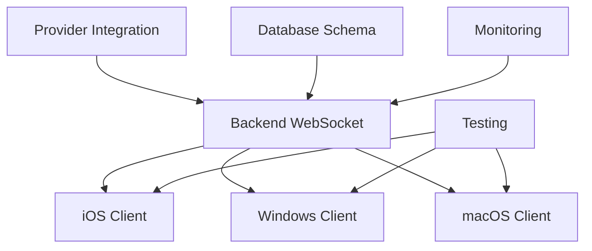

# Tasks: Real-Time Voice Processing Pipeline

## Development Tasks

### Backend Infrastructure Tasks (Week 1)

#### Core WebSocket Server
- [ ] Set up Node.js project with TypeScript and NestJS
- [ ] Implement WebSocket gateway with Socket.io
- [ ] Create session management with Redis
- [ ] Build connection pooling for providers
- [ ] Add authentication middleware with JWT
- [ ] Implement rate limiting and DDoS protection
- [ ] Set up graceful shutdown and reconnection logic
- [ ] Write unit tests for WebSocket handlers

#### Audio Processing Pipeline
- [ ] Implement audio buffer with ring buffer pattern
- [ ] Create Voice Activity Detection (VAD) module
- [ ] Build audio preprocessor (normalization, filtering)
- [ ] Implement Opus codec compression/decompression
- [ ] Add audio quality monitoring
- [ ] Create frame chunking for streaming
- [ ] Write tests for audio processing

#### Provider Integration Layer
- [ ] Create abstract provider interfaces (STT, TTS, AI)
- [ ] Implement Deepgram STT integration
- [ ] Add Google Cloud Speech integration
- [ ] Build Azure Cognitive Services connector
- [ ] Implement ElevenLabs TTS integration
- [ ] Add Azure Neural TTS fallback
- [ ] Create xAI API integration
- [ ] Build provider health monitoring
- [ ] Implement intelligent routing algorithm
- [ ] Add cost tracking per provider
- [ ] Write integration tests for each provider

### Database & Storage Tasks (Week 1-2)

- [ ] Design PostgreSQL schema for sessions and conversations
- [ ] Create database migrations with TypeORM
- [ ] Set up Redis for session state caching
- [ ] Implement conversation history storage
- [ ] Add audio recording storage to S3
- [ ] Create data retention policies
- [ ] Build backup and recovery procedures
- [ ] Write database performance tests

### iOS Client Tasks (Week 2)

#### Audio Capture
- [ ] Set up AVAudioEngine for recording
- [ ] Implement 16kHz PCM audio capture
- [ ] Add client-side VAD
- [ ] Create audio permission handling
- [ ] Build background audio support
- [ ] Implement audio interruption handling

#### WebSocket Client
- [ ] Integrate Socket.io client for iOS
- [ ] Implement secure WebSocket connection
- [ ] Add automatic reconnection logic
- [ ] Create message queuing for offline mode
- [ ] Build binary audio streaming
- [ ] Add connection state management

#### UI Components
- [ ] Design voice interaction UI in SwiftUI
- [ ] Create waveform visualization
- [ ] Add push-to-talk button
- [ ] Implement voice activation toggle
- [ ] Build conversation history view
- [ ] Add real-time transcript display
- [ ] Create loading and error states

### macOS Client Tasks (Week 2-3)

- [ ] Port iOS audio capture to macOS
- [ ] Add global hotkey support
- [ ] Implement menu bar integration
- [ ] Create audio device selection
- [ ] Build always-on-top window mode
- [ ] Add Siri Shortcuts support

### Windows Client Tasks (Week 3)

#### .NET Setup
- [ ] Create WinUI 3 project structure
- [ ] Set up .NET 8.0 configuration
- [ ] Add SignalR client for WebSocket

#### Audio Implementation
- [ ] Implement Windows.Media.Audio capture
- [ ] Add audio device enumeration
- [ ] Build VAD for Windows
- [ ] Create system tray integration

### Monitoring & DevOps Tasks (Week 3-4)

#### Metrics & Monitoring
- [ ] Set up Prometheus metrics collection
- [ ] Create Grafana dashboards
- [ ] Implement distributed tracing with Jaeger
- [ ] Add Sentry error tracking
- [ ] Build custom alerting rules
- [ ] Create performance benchmarks

#### Infrastructure
- [ ] Write Terraform scripts for AWS resources
- [ ] Set up Kubernetes manifests
- [ ] Create CI/CD pipeline with GitHub Actions
- [ ] Implement blue-green deployment
- [ ] Add auto-scaling configuration
- [ ] Set up load balancer with health checks

### Testing Tasks (Week 4)

#### Unit Tests
- [ ] Audio processing unit tests
- [ ] Provider routing logic tests
- [ ] Session management tests
- [ ] WebSocket protocol tests

#### Integration Tests
- [ ] End-to-end pipeline tests
- [ ] Provider failover tests
- [ ] Reconnection scenario tests
- [ ] Multi-client concurrent tests

#### Performance Tests
- [ ] Load testing with k6
- [ ] Latency benchmarking
- [ ] Memory leak detection
- [ ] Network resilience testing

#### Quality Assurance
- [ ] Audio quality validation
- [ ] Transcription accuracy testing
- [ ] Response coherence checks
- [ ] User acceptance testing

## Timeline

| Task Category | Assignee | Estimate | Week | Status |
|--------------|----------|----------|------|--------|
| WebSocket Server | Backend Team | 3 days | 1 | Not Started |
| Audio Pipeline | Voice Architect | 2 days | 1 | Not Started |
| Provider Integration | Integration Team | 5 days | 1-2 | Not Started |
| Database Setup | Backend Team | 2 days | 1 | Not Started |
| iOS Client | iOS Team | 5 days | 2 | Not Started |
| macOS Client | iOS Team | 3 days | 2-3 | Not Started |
| Windows Client | Windows Team | 5 days | 3 | Not Started |
| Monitoring | DevOps Team | 3 days | 3-4 | Not Started |
| Testing | QA Team | 5 days | 4 | Not Started |

## Definition of Done

### Code Quality
- [ ] Code reviewed by 2+ team members
- [ ] All tests passing with >80% coverage
- [ ] No critical security vulnerabilities
- [ ] Performance benchmarks met (<100ms latency)
- [ ] Documentation complete and reviewed

### Deployment
- [ ] Deployed to staging environment
- [ ] Load tested with 1000 concurrent users
- [ ] Monitoring and alerts configured
- [ ] Rollback procedure tested
- [ ] Feature flags configured

### Product
- [ ] Product owner demo and approval
- [ ] Beta user feedback incorporated
- [ ] Analytics tracking implemented
- [ ] A/B test framework ready
- [ ] Launch communication prepared

## Critical Path Items

These tasks must be completed in sequence and represent the minimum viable pipeline:

1. **WebSocket Server Setup** → 
2. **Deepgram Integration** → 
3. **xAI Integration** → 
4. **ElevenLabs Integration** → 
5. **iOS Audio Capture** → 
6. **End-to-End Testing**

## Risk Mitigation Tasks

High-priority tasks that reduce project risk:

- [ ] Provider failover mechanism (Day 3)
- [ ] Connection pooling (Day 2)
- [ ] Error recovery system (Day 4)
- [ ] Performance monitoring (Day 5)
- [ ] Cost tracking alerts (Day 3)

## Dependencies Between Teams

## Acceptance Criteria Checklist

- [ ] Voice input processed in <100ms end-to-end
- [ ] Automatic failover completes in <500ms
- [ ] 10,000 concurrent sessions supported
- [ ] 99.9% uptime achieved in staging
- [ ] All platforms (iOS, macOS, Windows) functional
- [ ] Cost per minute <$0.02
- [ ] User satisfaction >4.5/5 in beta